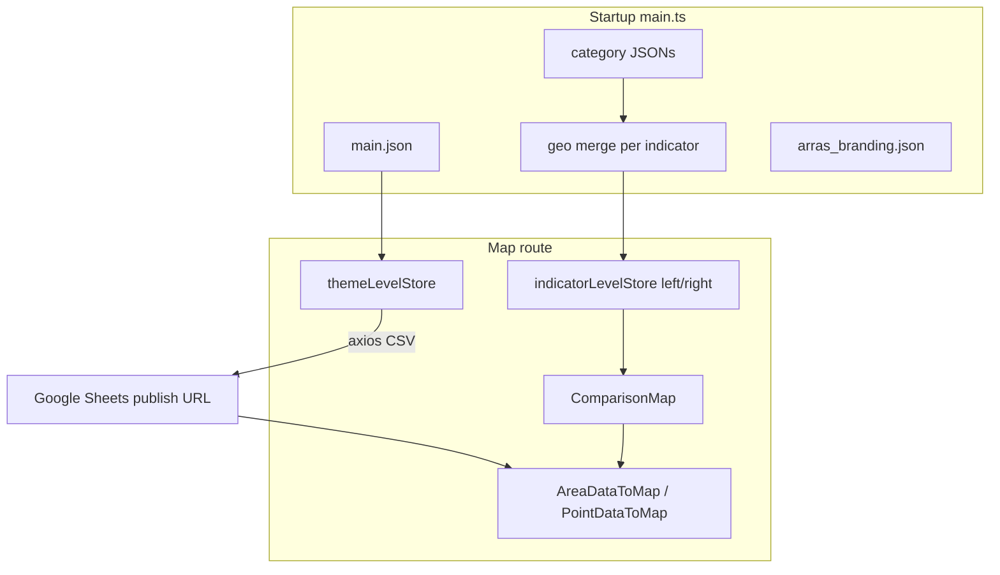

# Arras Community Health Indicator — Developer Guide

Technical reference for maintaining, extending, and deploying the application. For content/editor workflows, see [README.md](./README.md).

**Live:** [https://arras.north-arrow.org/](https://arras.north-arrow.org/)  
**Stack:** Vue 3 + TypeScript + Vite + Vuetify 3 + Pinia + MapLibre GL + D3

---

## Repository layout

```
public/
  config/           # Runtime JSON: main.json, economy.json, education.json, …
  slideshow/        # Landing carousel images (jpg/png; scanned at build)
  assets/           # Theme icons, map patterns, static images
  user_guide.pdf
src/
  views/            # Landing, MapPage, ConfigEditor
  components/       # ComparisonMap, TimelineVisualization, legends, Popup, …
  stores/           # Pinia: themeLevelStore, indicatorLevelStore, accessibilityStore
  utils/            # Map data pipeline: dataToMap, area/pointDataToMap, CSV, sync
  plugins/          # Vuetify setup
  styles/           # accessibility-base.css, accessibility-enhanced.css
  assets/           # maplibre-gl-compare (vendored JS/CSS)
  main.ts           # Bootstrap: load configs, merge geo, router, provide globals
vite/
  slideshowImagesPlugin.ts   # virtual:slideshow-images module
embed-test/         # iframe embed example + parent-sync.js
docs/               # Specs, accessibility, project updates
```

---

## Architecture overview



### Bootstrap (`src/main.ts`)

1. Fetch `config/main.json`, `config/arras_branding.json`.
2. Load each **enabled** category’s config file (`category.config` path).
3. For every indicator, **merge** `main.json` → `geo[geotype]` into the indicator (adds `geolevel`, `source_name`, `layers`).
4. `provide('mainConfig')`, `provide('categoryConfigs')`, `provide('arrasBranding')`, `provide('mitt')` event bus.

Router base: `import.meta.env.BASE_URL` (`/` production custom domain, `/dev/` for dev branch build).

### State management

| Store | Role |
|-------|------|
| `themeLevelStore` | Active theme (`?theme=`), loads all indicator CSVs via `google_sheets_url`, merges category style onto indicators |
| `indicatorLevelStore` (×2) | Per-map side (`left` / `right`): current indicator, year, geo selection, map instance, `DataToMap` worker |
| `accessibilityStore` | Enhanced visual toggle + `aria-live` announcements |

### Map page (`MapPage.vue` + `ComparisonMap.vue`)

- Two MapLibre maps with **maplibre-gl-compare** (side-by-side; solo mode expands one panel).
- Styles from `createArcGISStyle` + `mapRequestTransform` (ArcGIS API key in env / utils).
- Feature UI: custom panels + `Popup.vue` (not MapLibre popups); events `popup-{side}-changed` / `popup-{side}-clear`.
- `TimelineVisualization`, `ColorLegend` / `PointLegend` per side.
- `AccessibleGeographyList` + `a11y-select-feature` for keyboard geography selection.

### Data pipeline

| Class | File | Use |
|-------|------|-----|
| `DataToMap` | `utils/dataToMap.ts` | Base: sheet → map properties, gradients, legends |
| `AreaDataToMap` | `utils/areaDataToMap.ts` | Choropleth tracts/counties; hover/click/freeze |
| `PointDataToMap` | `utils/pointDataToMap.ts` | School/facility points; circle size/color |

CSV parsing: `utils/data-transformations.ts` → `formatGoogleSheetData()` (expects `geoid` header row + `pct_YYYY` / `count_YYYY` / `pop_YYYY` columns).

Indicator config types: `src/types/IndicatorConfig.ts`.

### Event bus (`mitt`)

Cross-cutting events include: `resize-maps`, `location-selected`, `feature-{side}-hovered`, `indicator-changed-{side}`, `a11y-select-feature`, embed sync (see `composables/useEmbedSync.ts`).

---

## Configuration system

| File | Purpose |
|------|---------|
| `public/config/main.json` | `landing_text`, `categories[]`, `geo{}`, `data_sources{}` |
| `public/config/{theme}.json` | `{ "indicators": [ … ] }` per theme |
| `public/config/arras_branding.json` | Named brand colors (referenced by key, not inline hex in categories) |

**Authoritative indicator schema:** [docs/INDICATOR_CONFIG_SPECIFICATION.md](./docs/INDICATOR_CONFIG_SPECIFICATION.md) (updated for `data_source`, `popup_legend`, `geo` merge).

**Config Editor:** `src/views/ConfigEditor.vue` at `/config-editor` — client-side only; download and commit files manually.

---

## Google Sheets integration

- URL field: `google_sheets_url` on each indicator.
- Loaded in `themeLevelStore.setCurrentTheme()` with `axios.get(url)` (public CSV).
- **No backend** — browser fetches Google; sheet must be published to web.
- CSV export URL must include `output=csv`.
- User-facing steps: [README.md](./README.md).

**Maintenance notes:**

- `formatGoogleSheetData` is line-based CSV split (not full RFC 4180); commas inside quoted fields can break rows.
- Special `geoid` normalization for IPUMS patterns (`005700` / `002300`) in `data-transformations.ts`.
- Extra legend layers may pull a second sheet via `legend.extra_layers.data_merge.google_sheets_url` (`dataToMap.generateExtraGeojson`).

---

## Landing slideshow

- Images: `public/slideshow/*.{jpg,jpeg,png}`.
- `vite/slideshowImagesPlugin.ts` exposes `virtual:slideshow-images` (filename list).
- `Landing.vue` builds URLs with `import.meta.env.BASE_URL`.
- **Adding/removing images requires rebuild/deploy** (list is fixed at build time; dev server watches folder and hot-reloads).

---

## Build & deploy

```bash
npm ci
npm run dev          # local dev, BASE_URL /
npm run build        # vue-tsc + vite → dist/
npm run preview      # serve dist locally
```

### GitHub Pages (`.github/workflows/deploy.yml`)

| Branch | Build | Publish path |
|--------|-------|----------------|
| `main` | `vite build --base=/` | `gh-pages` root → custom domain |
| `dev` | `vite build --base=/dev/` | `gh-pages/dev/` |

Uses `peaceiris/actions-gh-pages@v4` with `publish_dir: ./dist`.

**Note:** `package.json` script `deploy-gh` (git subtree) is legacy; CI is the source of truth.

`index.html` includes SPA redirect handling for GitHub Pages 404 → `index.html`.

### Environment / secrets

- ArcGIS basemap and `@arcgis/map-components` search: API key via project utils (see `createArcGISStyle`, `mapRequestTransform`).
- Monitor Arras ESRI account usage (documented in old README notes).

---

## Embed mode

- `embed-test/index.html` + `parent-sync.js` — iframe embed with URL sync to parent.
- `composables/useEmbedSync.ts` — avoids full page reload on theme change when `isInIframe()`.
- iframe `title` set in embed example HTML.

---

## Accessibility (implementation)

| Layer | Files |
|-------|-------|
| Default | `accessibility-base.css`, component ARIA/labels, `AccessibleGeographyList.vue` |
| Enhanced toggle | `accessibilityStore.ts`, `accessibility-enhanced.css`, button in `App.vue` |
| Docs | [docs/accessibility-features.md](./docs/accessibility-features.md), [docs/accessibility-audit.md](./docs/accessibility-audit.md) |

Brand colors in `arras_branding.json` are intentionally unchanged; contrast work is deferred.

---

## Common maintenance tasks

| Task | Touch |
|------|--------|
| New indicator | `public/config/<theme>.json` + Google Sheet + spec checklist |
| New geotype | `main.json` → `geo` + map style layers in ArcGIS style JSON |
| Theme header color | `main.json` category `style.colors.icon` → key in `arras_branding.json` |
| Popup/legend copy | Indicator JSON only |
| Choropleth stops | Indicator `style.min` / `style.mid` / `style.max` merged with category style in `themeLevelStore` |
| Compare / solo layout | `ComparisonMap.vue` CSS + `viewMode` |
| CSV download labels | `src/constants.ts` (`CSV_DOWNLOAD_CELL_REPLACEMENTS`), `csvDownload.ts` |
| Split-map sync | `mapboxGlSyncMoveWithPadding.ts`, search pins `searchLocationLayer.ts` |

---

## Testing checklist (developer)

- [ ] `npm run build` passes (`vue-tsc -b`).
- [ ] Each `?theme=` loads, indicators switch, timeline years work.
- [ ] Google Sheet publish URL returns CSV in browser.
- [ ] Side-by-side + solo modes; resize; compare divider.
- [ ] Location search flyTo (both maps).
- [ ] Config Editor validate/download for edited JSON.
- [ ] Accessibility: skip link, browse geographies, enhanced toggle.
- [ ] `dev` branch preview at `/dev/` if changing routing/base.

---

## Known issues / tech debt

(from README notes + audit — not exhaustive)

- Location search placement/UX still rough.
- Duplicate school `geoid` / address edge cases in source data.
- Map remains pointer-primary; keyboard browse list is supplemental.
- `body.style.zoom` removed; small screens use CSS font scaling on header only.
- Config editor uses `alert()` for validation feedback.
- Brand palette WCAG contrast not resolved.
- Left map zoom controls hidden in default side-by-side (shown in enhanced a11y mode).

---

## Agent-oriented quick map

When fixing bugs, start here:

1. **Data wrong on map** → Sheet columns + `formatGoogleSheetData` + indicator `yearValuePrefix` / `map.color`.
2. **Indicator missing** → `enabled`, theme JSON, `short_name`, `geotype` in `main.geo`.
3. **Panel/popup wrong** → `areaDataToMap` / `pointDataToMap` + `Popup.vue` + indicator `popup`.
4. **Layout/chrome** → `MapPage.vue` CSS vars, `ComparisonMap.vue`.
5. **Deploy 404 on assets** → ensure full `dist/` published (CI), not partial subtree.
6. **Styles** → Vuetify in `plugins/vuetify.js`; global `style.css` (Benton Sans).

---

## Related documents

- [README.md](./README.md) — non-developer handoff
- [docs/INDICATOR_CONFIG_SPECIFICATION.md](./docs/INDICATOR_CONFIG_SPECIFICATION.md)
- [docs/accessibility-features.md](./docs/accessibility-features.md)
- [docs/accessibility-audit.md](./docs/accessibility-audit.md)
