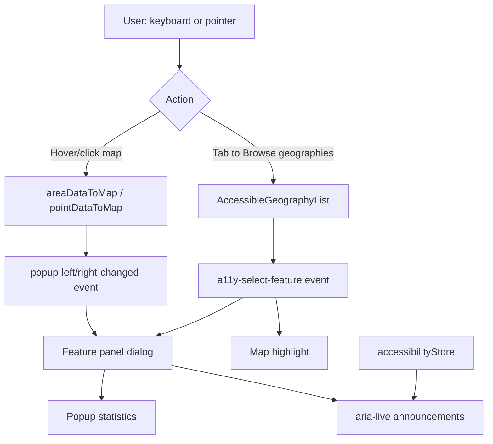

# Accessibility Features — User & Developer Guide

This document describes accessibility behavior added to the Arras Community Health Indicator application. It complements the WCAG gap analysis in [accessibility-audit.md](./accessibility-audit.md).

**Important:** None of these changes modify hex values in [`public/config/arras_branding.json`](../public/config/arras_branding.json). Brand colors used on maps and legends are unchanged.

---

## Overview

Accessibility is split into two layers:

| Layer | How it is enabled | Purpose |
|-------|-------------------|---------|
| **Default (always on)** | No user action | Structure, keyboard paths, screen reader support, labels, and non-visual alternatives |
| **Enhanced display** | App bar button below the menu (human icon) | Optional visual aids: stronger focus, motion reduction, text shadows, legend emphasis |

State for enhanced display is stored in the browser as `localStorage` key `arras-a11y-enhanced` and applied by adding the class `a11y-enhanced` to `<html>`.

---

## Default features (always on)

These run for every visitor. They do not change brand palette values.

### Global shell (`App.vue`, `src/styles/accessibility-base.css`)

- **Skip link** — “Skip to main content” appears when focused (Tab from page load); jumps to `#main`.
- **Screen reader utilities** — `.sr-only` hides content visually while keeping it available to assistive tech.
- **Focus indication** — `:focus-visible` outline (2px, dark blue) on interactive elements that support it.
- **Live status region** — `#a11y-status` with `aria-live="polite"` announces important changes (via Pinia store).
- **Loading screen** — `role="status"`, `aria-live="polite"`, `aria-busy="true"` while data loads; busy cleared when maps are ready.
- **Navigation menu** — Hamburger is a real `v-btn` with `aria-label="Open navigation menu"` (keyboard activatable).
- **Home control** — Logo button has `aria-label="Home"`; loading/sidebar logos have appropriate `alt` text.
- **External links** — User Guide (and similar) show “(opens in new tab)” via `.opens-new-tab` and use `rel="noopener noreferrer"`.
- **Responsive text** — Below 1280px width, map header chrome scales slightly via CSS instead of the former `document.body.style.zoom` hack (removed).

### Page titles and headings

- **`document.title`** updates on route change (`main.ts`): e.g. theme name on map routes.
- **Landing** — Visually hidden `<h1>` (“Arras Community Health Indicator Tool”); section title for categories uses `aria-level="2"`.
- **Map** — Theme name is an `<h1>` in the header overlay (`MapPage.vue`).
- **Map landmark** — Comparison maps sit in a region labeled “Community health indicator comparison maps”.

### Map page layout (`MapPage.vue`)

- **DOM order** — Header (title + search) comes before the map in the document, so screen readers encounter context before the map application. The map still fills the viewport visually (absolute positioning).
- **Dynamic chrome height** — `--map-chrome-height` is measured from the header so solo buttons sit below the title/search when the title wraps to two lines.

### Comparison maps (`ComparisonMap.vue`)

- **Map regions** — Left/right map containers have `role="region"` and descriptive `aria-label`s.
- **Feature detail panel** — When visible:
  - `role="dialog"`, `aria-labelledby` pointing at the feature name heading
  - Close control: `aria-label="Close feature details"`, Escape key, focus moves to close on open
  - Status announcements when a feature is shown or pinned
- **View mode** — Switching side-by-side / solo left / solo right is announced in the live region.
- **Location search** — Map fly-to after search is announced; animation duration is **0** when enhanced mode is on **or** the OS has `prefers-reduced-motion: reduce` (see below).

### Keyboard geography browse (`AccessibleGeographyList.vue`)

Map clicking/hovering alone is not keyboard-friendly. Each map panel includes a **“Browse geographies”** autocomplete:

1. Lists geographies from the current indicator’s sheet data (same filters as the timeline: excludes `filterOut` geoids and school districts).
2. Typing searches by name.
3. Selecting an entry emits `a11y-select-feature`, handled in `areaDataToMap.ts` / `pointDataToMap.ts` to:
   - Highlight the feature on the map
   - Open/freeze the feature panel with full statistics
   - Sync hover/click emitter events used elsewhere in the UI

Clearing the autocomplete clears the panel.

### Timeline (`TimelineVisualization.vue`)

- **SVG** — `role="img"` and dynamic `aria-label` describing the indicator and year range.
- **Hidden data table** — `.sr-only` table lists year/value pairs for screen readers.
- **Year points** — Circles are `tabindex="0"`, `role="button"`, with `aria-label` per year; **Enter** or **Space** selects that year (same as click).
- **Legend text** — Series identified in words (“selected average”, “Statewide”, “hovered”) so meaning is not color-only in the legend row.

### Forms and controls

| Control | Location | Default behavior |
|---------|----------|------------------|
| Indicator select | `IndicatorSelector.vue` | `label="Indicator"`, `aria-label="Select health indicator"` |
| Year select | `TimelineVisualization.vue` | `label="Year"` (unchanged) |
| Location search | `LocationSearch.vue` | `<section>` with screen-reader-only label |
| Color legend gradient | `ColorLegend.vue` | `role="img"` + `aria-label` describing min/mid/max scale |
| Info icon | `ColorLegend.vue` | `aria-label="Indicator information"` |

### Landing page (`Landing.vue`)

- Carousel slides have `aria-label` derived from filenames (e.g. “Community photo: …”).
- Category button icons are decorative (`alt=""`, `aria-hidden`).
- Carousel **autoplay is disabled** when enhanced mode is on or OS prefers reduced motion (motion handling is split; see enhanced section).

### Popup (`Popup.vue`)

- Feature name exposed as heading with `id` for `aria-labelledby` from the dialog.
- Popup legend and stat styling unchanged in default mode (color still used; enhanced mode adds text prefixes).

### Developer wiring

| File | Role |
|------|------|
| `src/stores/accessibilityStore.ts` | Toggle state, `localStorage`, `announce()`, `html.a11y-enhanced` class |
| `src/styles/accessibility-base.css` | Skip link, sr-only, focus, new-tab hint |
| `src/main.ts` | Imports base + enhanced CSS; router `document.title` |
| `src/utils/areaDataToMap.ts`, `pointDataToMap.ts` | `a11y-select-feature` handler |

---

## Enhanced display button

### Where to find it

Top-left app bar, **below** the hamburger menu, stacked with the home logo and menu. Icon: **human figure** (`mdi-human`). Outlined when inactive.

- **`aria-pressed`** reflects on/off state.
- **`aria-label`:** “Toggle enhanced accessibility display (contrast, motion, and visual aids)”
- Turning on/off is announced in the live region.

### What it does

Toggles `html.a11y-enhanced` and loads rules from [`src/styles/accessibility-enhanced.css`](../src/styles/accessibility-enhanced.css). Preference persists across sessions.

| Area | Effect |
|------|--------|
| **Focus** | Thicker black focus ring (3px) on `:focus-visible` |
| **Theme title** | Dark **text-shadow** on white title text over brand-colored header (does not change background brand color) |
| **Legends** | Legend labels and data-source links forced to darker, slightly larger, bolder text (`#1a1a1a`) — not brand JSON edits |
| **Panels** | Feature panel, timeline card, location search: 2px dark border |
| **Feature popup** | CSS prefixes: “Primary value:”, “Secondary value:”, “Share:”, “Count:” before colored stat text |
| **Motion** | Loading animations off; landing hover “lift” off; D3 timeline transitions 0ms; map `flyTo` duration 0; landing carousel autoplay off |
| **OS reduced motion** | When enhanced is on, `@media (prefers-reduced-motion: reduce)` further clamps animations/transitions |
| **Left map zoom** | In side-by-side view, MapLibre zoom/compass controls on the **left** map are shown (hidden by default to reduce clutter) |
| **Page zoom** | Forces `body { zoom: 1 }` if anything else set zoom |

### What it does **not** do

- Does not change colors in `arras_branding.json`.
- Does not add map hatch patterns or replace choropleth fills.
- Does not add a full-screen data-table-only view (CSV download remains the data export path).
- Does not fix all contrast failures on every theme/header combination automatically.

---

## How pieces work together (map workflow)

---

## Outstanding issues (not yet addressed)

These remain from [accessibility-audit.md](./accessibility-audit.md). Enhanced mode mitigates some symptoms but does not replace proper fixes where noted.

### Brand colors (`arras_branding.json`)

- Map choropleth and point layers use brand hex values for data encoding. **WCAG 1.4.1 (use of color)** and **1.4.3 (contrast)** may still fail for some combinations (e.g. yellow, beige, pale-blue on white legend text or as large-area fills).
- Theme header uses `style.colors.icon` from category config → background from branding; white title text may lack sufficient contrast on lighter brand swatches until a dedicated palette review is done.
- **Planned direction (not implemented):** Document approved color pairs, adjust category `style.colors.icon` assignments, and/or add non-color map encodings without editing the canonical brand JSON without stakeholder sign-off.

### Map interaction gaps

- **Canvas maps** are still not fully keyboard-operable for pan/zoom/feature pick (industry limitation); browse list is the provided alternative.
- **Hover-only** feature preview on mouse move — keyboard users rely on selection/freeze via browse list or click; hover tooltips on map without keyboard parity for **1.4.13** remain partially open.
- **Compare slider** (if enabled in other modes) is pointer-only; no keyboard split control.
- **Right vs left** — Default side-by-side still hides left zoom controls until enhanced mode or solo-left.

### Data visualization

- Values on the map are still primarily **color**; no hatch patterns or on-map numeric labels at zoom levels.
- Timeline lines still use blue / orange / gray; default legend adds words, but the chart lines themselves are unchanged.
- Point legend size scale is still visual-only (circle sizes).

### Content and tooling

- Landing intro uses `v-html` from config — semantic quality depends on config markup.
- **Config editor** still uses `alert()` for some validation feedback.
- **Config editor** and embed flows were not part of the accessibility pass.
- No automated a11y tests in CI (axe, pa11y, etc.).

### Testing recommended

Before claiming WCAG 2.2 AA conformance, run through the checklist in [accessibility-audit.md § Testing checklist](./accessibility-audit.md#testing-checklist-post-fix), including screen readers (NVDA/VoiceOver), keyboard-only navigation, and per-theme contrast checks on header + legend colors.

---

## Related documents

- [accessibility-audit.md](./accessibility-audit.md) — WCAG-scoped gap analysis and remediation roadmap
- [INDICATOR_CONFIG_SPECIFICATION.md](./INDICATOR_CONFIG_SPECIFICATION.md) — Indicator/config behavior (relevant to popup and legend text)

---

*Last updated: May 2026 — reflects implementation in `src/stores/accessibilityStore.ts`, `src/styles/accessibility-*.css`, and component changes listed above.*
